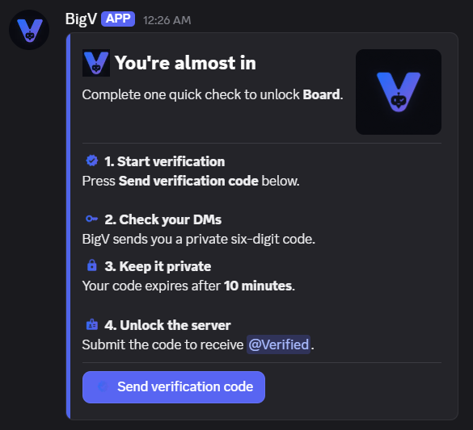
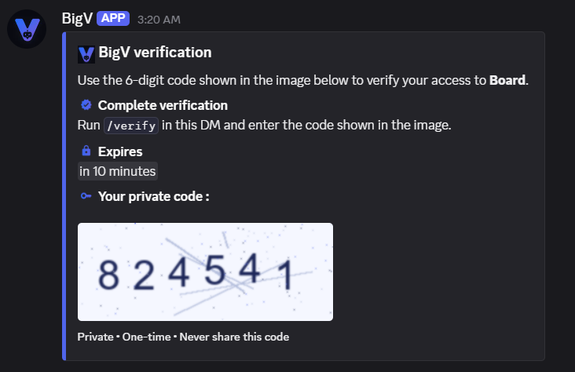

# BigV

> A modern, open-source Discord verification bot built to make server verification simple, secure, resilient, and pleasant to use.

BigV is a multi-server Discord verification bot built with **Python**, **discord.py**, **SQLite**, and **Pillow**. It creates a dedicated verification experience for a server, sends members a private one-time code through DMs, verifies that code through `/verify`, and assigns a configurable `Verified` role.

The project started as a learning project after finishing CS50. I wanted to build something larger than a tutorial bot and use it to learn how a real Discord application works: async programming, slash commands, persistent components, permissions, databases, error handling, self-healing behavior, logging, UI/UX, and deployment.

BigV is intended to be **open source** so other developers can inspect it, learn from it, improve it, and adapt it for their own communities.
---

## Preview

### Verification panel

BigV creates a dedicated verification panel where members can request a private verification code.



### Private CAPTCHA verification

The six-digit verification code is rendered as an image and sent privately through Discord DMs.



---

## Features

- Multi-server support — no hardcoded guild ID
- `/setup` command for server administrators
- Dedicated `#bigv-verification` channel
- Automatically created `Verified` role
- Persistent Discord verification button
- Private 6-digit verification codes sent as generated PNG images through DMs
- SHA-256 hashed codes in the database
- 10-minute code expiration
- Maximum of 5 failed attempts
- Attempt limits enforced across simultaneous multi-server requests
- Leading-zero code support
- Already-verified detection
- Closed-DM handling
- Role hierarchy checks
- Discord permission checks
- SQLite persistence with `aiosqlite`
- Self-healing verification configuration
  - recreates a deleted Verified role
  - recreates a deleted verification channel
  - recreates a deleted verification message
- Protection against normal messages in the verification channel
- Periodic repair task
- Setup rollback when Discord or database operations fail
- Structured application logging
- Modern Discord Components V2 UI
- Persistent `LayoutView` interactions
- BigV application emojis with Unicode fallbacks
- Logo-based color system and branded UI
- `/help` onboarding and command guide
- Guild-specific names, icons, roles, and channel context
- Discord-native relative timestamps
- Mobile-friendly message formatting

---

## Commands

### `/help`

Shows the BigV help guide, available commands, verification steps, administrator setup instructions, and common troubleshooting information.

### `/ping`

Checks whether BigV is online.

### `/setup`

Configures BigV in the current server.

Requirements:

- Must be used inside a server
- User must have **Administrator**
- BigV requires:
  - **Manage Roles**
  - **Manage Channels**
  - **Manage Messages**

BigV creates:

- a `Verified` role
- a `#bigv-verification` channel
- a persistent verification panel

### `/verify <code>`

Used in a DM with BigV.

Example:

```text
/verify 004217
```

If the code is valid and has not expired, BigV assigns the `Verified` role in the server where the verification request started.

---

## How verification works

1. A server administrator runs `/setup`.
2. BigV creates the verification role, channel, and persistent panel.
3. A member presses **Send verification code**.
4. BigV creates a random six-digit code.
5. Only a SHA-256 hash of the code is stored in SQLite.
6. The real code is rendered with Pillow and sent privately as an image through DM.
7. The member runs `/verify <code>` in their DM with BigV.
8. BigV checks the code, expiration time, server, member, role, and permissions.
9. If verification succeeds, BigV assigns the `Verified` role.
10. The pending verification challenge is deleted.

Codes expire after **10 minutes**.

A challenge is also removed after **5 incorrect attempts**.

---

## Self-healing

BigV is designed to recover from common configuration damage.

If the configured:

- `Verified` role is deleted
- verification channel is deleted
- verification message is deleted

BigV can recreate the missing resource and save the new IDs to the database.

The bot also runs a periodic repair pass so missed/offline deletion events can still be recovered later.

One failing guild does not stop the periodic repair process for the other guilds.

---

## Project structure

```text
BigV/
|-- bot.py
|-- database.py
|-- ui.py
|-- requirements.txt
|-- .env.example
|-- .gitignore
|-- assets/
|   |-- brand/
|   |   `-- bigv_logo.png
|   |-- emojis/
|   |   |-- bigv_verify.png
|   |   |-- bigv_success.png
|   |   |-- bigv_error.png
|   |   |-- bigv_warning.png
|   |   |-- bigv_shield.png
|   |   |-- bigv_lock.png
|   |   |-- bigv_code.png
|   |   |-- bigv_help.png
|   |   |-- bigv_role.png
|   |   |-- bigv_channel.png
|   |   `-- bigv_repair.png
|   |-- README.md
|   |-- EMOJIS.md
|   |-- THIRD_PARTY.md
|   `-- licenses/
|-- tests/
|   |-- support.py
|   |-- test_bot.py
|   |-- test_database.py
|   `-- test_ui.py
`-- BigV.db              # generated locally, ignored by Git
```

The exact tree may change as the project develops.

---

## Installation

### 1. Clone the repository

```bash
git clone https://github.com/DragonsGames/BigV.git
cd BigV
```

### 2. Create a virtual environment

Windows:

```powershell
python -m venv .venv
.venv\Scripts\Activate.ps1
```

Linux/macOS:

```bash
python3 -m venv .venv
source .venv/bin/activate
```

### 3. Install dependencies

```bash
pip install -r requirements.txt
```

### 4. Create your environment file

Copy:

```text
.env.example
```

to:

```text
.env
```

Then add your Discord bot token:

```env
DISCORD_TOKEN=your_bot_token_here
```

Never commit `.env`.

---

## Discord application setup

Create a Discord application and bot in the Discord Developer Portal.

When inviting BigV to a server, it needs the permissions required by its current feature set:

- Manage Roles
- Manage Channels
- Manage Messages
- View Channels
- Send Messages
- Read Message History
- Embed Links

BigV does **not** require the Administrator permission itself.

The user running `/setup` must have Administrator permission.

After installation, make sure BigV's bot role is positioned high enough in the server role list to assign the `Verified` role.

---

## Custom BigV application emojis

BigV supports the following application emoji names:

```text
bigv_verify
bigv_success
bigv_error
bigv_warning
bigv_shield
bigv_lock
bigv_code
bigv_help
bigv_role
bigv_channel
bigv_repair
```

Prepared assets are stored in:

```text
assets/emojis/
```

Upload them as **application emojis** in the Discord Developer Portal using the filename without `.png`.

Example:

```text
assets/emojis/bigv_success.png
```

should be uploaded as:

```text
bigv_success
```

BigV fetches application emojis during startup and resolves them by name.

If one is unavailable, BigV falls back to a normal Unicode emoji, so missing custom artwork never breaks verification.

See `assets/EMOJIS.md` for more details.

---

## Branding

The canonical BigV logo is:

```text
assets/brand/bigv_logo.png
```

The UI palette is based on the BigV logo.

Current brand colors include:

```text
Logo blue      #2C6AF7
Primary        #5064EB
Logo violet    #685EE3
Logo ink       #090B10
```

Semantic success, warning, error, and neutral colors are kept separate so status remains easy to understand.

The branding layer is intentionally centralized so the project can be visually updated without rewriting the verification backend.

---

## Database

BigV uses SQLite through `aiosqlite`.

The database stores information such as:

- guild configuration
- verified role ID
- verification channel ID
- verification message ID
- pending verification user/server pairs
- hashed verification codes
- expiration timestamps
- failed-attempt counts

The database file is:

```text
BigV.db
```

and should remain ignored by Git.

Verification codes are **not stored in plaintext**.

---

## Security notes

BigV intentionally follows several basic security practices:

- Bot token is loaded from `.env`
- `.env` is ignored by Git
- Verification codes are generated using Python's `secrets` module
- Verification codes are hashed before being stored
- Codes expire after 10 minutes
- Failed attempts are limited
- Codes are sent only through private DMs
- Codes are not written to logs
- Code hashes are not written to logs
- Successful challenges are consumed
- Failed Discord role assignment does not incorrectly consume a still-valid challenge
- Setup performs rollback when possible if configuration fails partway through

BigV is still an open-source student project. If you plan to deploy it at significant scale, perform your own security review and testing.

---

## Error handling and resilience

BigV handles expected failures including:

- Discord permission errors
- Discord HTTP/API failures
- missing guilds
- missing members
- role hierarchy problems
- blocked DMs
- SQLite errors
- setup failures
- rollback cleanup failures
- repair failures

Structured Python logging is used so operational failures can be diagnosed without exposing verification secrets.

---

## AI-assisted development

BigV is **my project**, but I used AI tools as development assistants during the process.

I want to be transparent about that rather than claiming the project was written with no AI assistance.

AI was used for things such as:

- explaining Discord API and `discord.py` concepts
- reviewing code and identifying edge cases
- discussing error-handling strategies
- helping design testing plans
- generating/refining logging boilerplate
- UI/UX brainstorming and implementation assistance
- visual design refinement
- custom icon/emoji integration
- wording and message polish
- documentation assistance

The core project idea, architecture decisions, verification flow, learning process, testing decisions, and a large part of the implementation were developed iteratively by me while learning how each part worked.

For important parts of the bot, I followed a learning-oriented workflow:

1. understand the concept
2. write or modify the implementation
3. test it
4. review failures
5. improve it
6. use AI for guidance/review where useful

Some presentation and boilerplate work was implemented with AI assistance, especially during the UI/UX polish phase.

I do **not** claim that BigV contains no AI-generated or AI-assisted code.

AI was treated as a development tool, not as a replacement for understanding the project.

---

## Why I built BigV

I built BigV after completing CS50 because I wanted a project that forced me to go beyond isolated exercises.

A Discord bot looked simple at first, but building a real verification bot introduced problems that tutorials often skip:

- asynchronous code
- persistent UI
- multiple servers
- permissions
- role hierarchy
- database persistence
- failure recovery
- API errors
- rollback
- state consistency
- background tasks
- UI/UX
- logging
- deployment concerns

That made BigV useful as both a real bot and a learning project.

The goal was not only to make verification work, but to understand what happens when it **doesn't** work and build the bot so it can recover cleanly.

---

## Open source

BigV is intended to be an **open-source project**.

You are welcome to:

- inspect the code
- learn from it
- report bugs
- suggest improvements
- fork it
- adapt it to your own project
- contribute improvements through pull requests

Please keep attribution and license terms in mind when redistributing the project or included third-party assets.

```markdown
### License

BigV is licensed under the **MIT License**.

See [`LICENSE`](LICENSE) for the full license text.

Third-party visual assets may have their own licenses. See:

```text
assets/THIRD_PARTY.md
assets/licenses/

Third-party visual assets may have their own licenses. See:

```text
assets/THIRD_PARTY.md
assets/licenses/
```

---

## Development status

BigV is currently approaching its first stable release.

The core verification workflow is implemented, including:

- setup
- verification
- persistence
- resilience
- logging
- self-healing
- UI/UX
- custom application emojis
- help/onboarding
- automated regression tests

Before a stable `v1.0.0` release, the project should complete its live end-to-end Discord testing and deployment validation.

---

## Contributing

Contributions are welcome.

A simple contribution workflow:

```bash
git clone https://github.com/DragonsGames/BigV.git
cd BigV
git checkout -b feature/your-change
```

Make your changes, test them, and open a pull request.

Good contribution areas include:

- bug fixes
- tests
- documentation
- Discord accessibility
- deployment improvements
- UI refinements
- reliability improvements

Please avoid weakening verification security or introducing unnecessary dependencies.

---

## Testing

BigV includes an automated test suite built with Python's standard `unittest` framework. No additional testing dependency is required.

Run the complete suite from the repository root:

```bash
python -m unittest discover -s tests -v
```

The tests cover:

- SQLite initialization, settings, pending challenges, expiration, and multi-server attempt tracking
- setup permissions, resource creation, rollback, and channel lockdown
- verification success, invalid and expired codes, role assignment, DM behavior, and controlled database/API failures
- deleted role, channel, and message repair paths
- periodic repair and cleanup tasks
- persistent views, custom emoji fallbacks, semantic UI states, and safe mentions

Database tests use temporary directories, and Discord behavior is tested with isolated fakes and mocks. Running the automated suite does not modify the project's local `BigV.db` or connect the bot to Discord.

You can also validate Python syntax with:

```bash
python -m compileall -q bot.py database.py ui.py tests
```

Automated tests should be followed by a complete live Discord flow in a dedicated test server before release:

```text
/setup
→ verification panel
→ Verify button
→ DM
→ /verify
→ Verified role
```

Important resilience tests include:

- blocked DMs
- invalid codes
- expired codes
- five failed attempts
- role hierarchy failure
- deleted verification message
- deleted verification channel
- deleted Verified role
- restart + persistent button
- missing custom application emoji fallback

---

## Roadmap

Potential future work includes:

- CI validation
- expanding regression coverage as features change
- production deployment documentation
- easier installation/deployment
- additional administrator configuration
- more advanced observability
- accessibility refinements

The goal is to keep BigV focused: a reliable verification bot, not an unnecessarily large moderation suite.

---

## Author

Created by **Mohammed Sellami** (`DragonsGames`).

Built as a learning-driven open-source project after CS50.

---

## Acknowledgements

- Discord and the Discord API
- `discord.py`
- `aiosqlite`
- Pillow
- Python
- CS50
- Google Material Icons / Material Symbols where used in BigV's custom visual asset family
- AI tools used transparently as development assistants during design, review, debugging, and documentation

See the repository's third-party asset documentation for applicable visual asset licenses.
